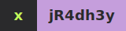

  

  A Computer Science Engineering student from Jammu. I love exploring and learning by building

  

  
  
  
  
  
  
  
  
  
  
  
  
  
  
  
  
  
  
  
  
  
  
  

<!-- Contact -->

  
  
  
   

<!-- Footer wave -->

  

